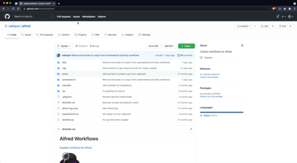
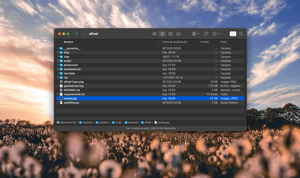
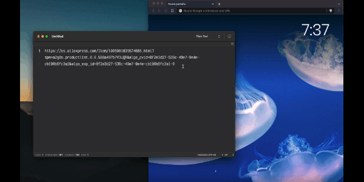
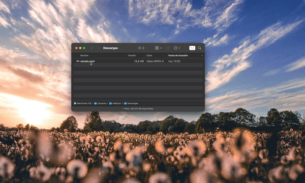
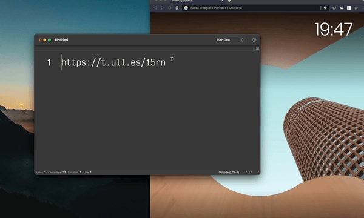

# Alfred Workflows

<!--
**Autoreminder**: Screen-recordings should have ratio 1.6. It can be recorded at 1600x960 and then rescaled to 600x360 using gif conversion. -->

Custom [workflows](https://www.alfredapp.com/workflows/) for [Alfred](https://www.alfredapp.com/).

## endor

It's a very customized workflow to monitor a remote server. It's launched with `endor` keyword and it shows some information about the remote machine:

- CPU frequency.
- Memory usage.
- Disk usage.
- CPU load.

> I know it's quite difficult to adapt it to common cases since it's based on a concrete API.

[Take a look of this workflow!](endor)

## vip

Show information about networking:

- Local IP.
- Public IP.
- MAC address.

[Take a look of this workflow!](vip)

## bitly

Shorten url from clipboard using bitly.com API. Resulting url is also copied to the clipboard.

[Take a look of this workflow!](bitly)

## translate

Translations between Spanish & English through library [wrpy](https://github.com/sdelquin/wrpy).

[Take a look of this workflow!](translate)

## ciap

Calculate the final price of an Amazon product if it were delivered to Canary Islands.

[Take a look of this workflow!](ciap)

## savetweetvid

Download the video (as url) from a tweet url that it's already in the clipboard. Resulting downloaded video is shown on the browser and also copied to the clipboard.

[Take a look of this workflow!](savetweetvid)

## photoroom

Remove background of selected images (in Finder) through the [PhotoRoom API](https://photoroom.com/api).

[Take a look of this workflow!](photoroom)

## cleanurl

Remove tracking and extra query params from URLs.

For example:

https://es.aliexpress.com/item/1005001835574685.html?spm=a2g0o.productlist.0.0.588a497b7V3uQR&algo_pvid=8f2e3d27-536c-49e7-9e4e-cb190b6fc3a1&algo_exp_id=8f2e3d27-536c-49e7-9e4e-cb190b6fc3a1-0

👇🏻

https://es.aliexpress.com/item/1005001835574685.html

**Disclaimer**: This is not "smart" at all. Use it carefully since it only remove the rest of the URL after the ? sign.

> 💡 &nbsp;URL must be previously copied to clipboard.

[Take a look of this workflow!](cleanurl)

## vcompress

Compress video files using [ffmpeg](https://www.ffmpeg.org/).

[Take a look of this workflow!](vcompress)

## unshorten

Unshorten URL from shortened URL.

> 💡 &nbsp;URL must be previously copied to clipboard.

[Take a look of this workflow!](unshorten)

## ivaigic

Convert price with [IVA](https://es.wikipedia.org/wiki/Impuesto_al_valor_agregado) into price with [IGIC](https://es.wikipedia.org/wiki/Impuesto_General_Indirecto_Canario).

[Take a look of this workflow!](ivaigic)
